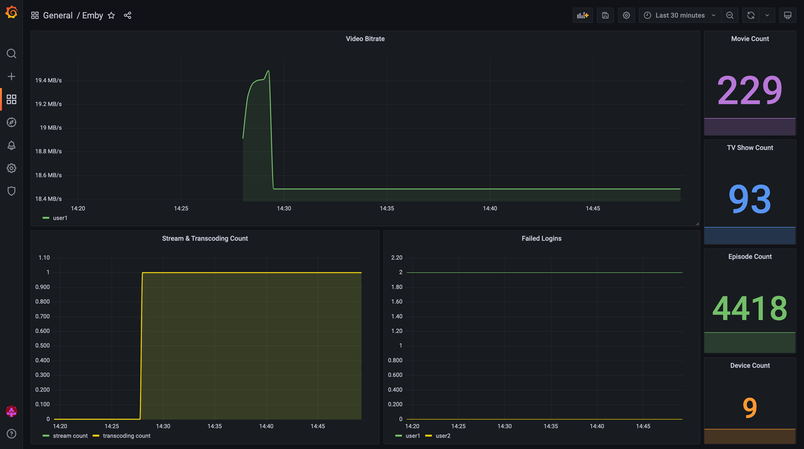

# Emby exporter

A Prometheus exporter for Emby metrics written in Go.



List of available metrics:

- emby_audio_bitrate
- emby_audio_channels
- emby_device_count
- emby_episode_count
- emby_failed_login
- emby_movie_count
- emby_serie_count
- emby_stream_count
- emby_transcoding_count
- emby_user_count
- emby_video_bitrate

## Usage

```
NAME:
  emby_exporter - A Prometheus exporter that exports metrics on Emby Media Server.

USAGE:
  emby_exporter [options]

OPTIONS:
  --telemetry.addr        Port for server (default: ":9162")
  --telemetry.path        URL path for metric collection (default: "/metrics")
  --emby.verifyTLS        Verify TLS certificate of Emby Server (default: true)
  --emby.addr             URL address of Emby API
  --emby.token            Emby API token
  --health                Run a healthcheck of the exporter
  --help, -h              Show help
```
